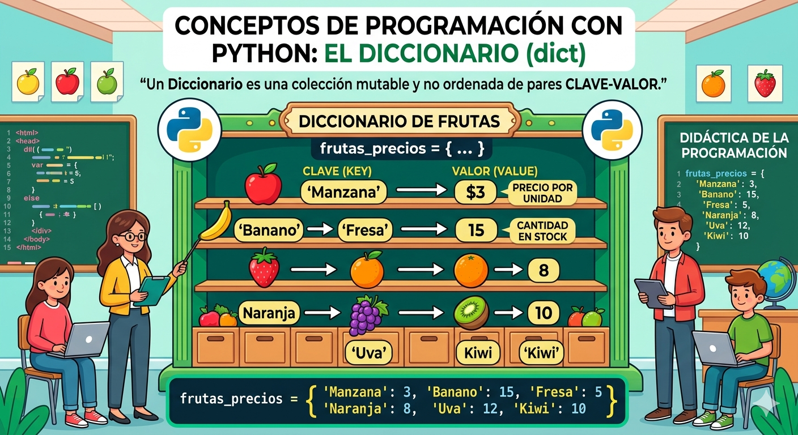

# diccionarios_python
conceptos y ejercicios de diccionarios en pythoon

- Los diccionarios son datos estructurados, es decir, hacen referencia a una coleccion de datos.
- Son una coleccion desordenada de pares de datos de la forma **clave valor**, conocidos como elementos oitems
- Son mutables, una vez definido se le pueden agregar nuevos elementos, modificar o eliminar algunos de los que ta tiene.
- Tambien son conocidos como arreglos asociativos.

## Representacion gráfica den un diccionario



# Sintaxis
`nombre_diccionario = {clave1:valor1 clave2:valor2,....}`
- Cada item o elemento tiene la forma **clave**
- En cada item hay una clave y uno o mas valores. Si se desconoce el valor, se puede completar con *None*
- Los elementos del diccionario se indexan por la clave
- Los valores pueden ser mutables o inmutables
- Las claves no pueden repetirse dentro del diccionario

### Ejemplo
`frutas = ,{'manzana':34, 'pera':45}`

## Operaciones

### Agregar elementos
`nombre_diccionario[clave] = valor`
`fruta['cereza'] = 90`

### Consultar o modificar elementos
`print(el valor de pera es: ', frutas['pera'])`

### Eliminar elementos
`del fruta['pera']`

### Operador de competencia
``` python
if 'cereza' in frutas:
    print('Si esta cereza en el diccionario')
else:
    ('No esta en el diccionario')
```

## Ejercicio
Cree un programa en Python que utilice un diccionario para guardar los nombres de sus amigos y su telefono.  En este caso, el diccionario representa una agenda telefónica.  El programa pedirá nombres y telefonos y los irá guardando en el diccionario (los nombres en mayúscula).  Además, el programa debe permitir consultar o eliminar un telefono. Incluya un menú de opciones.